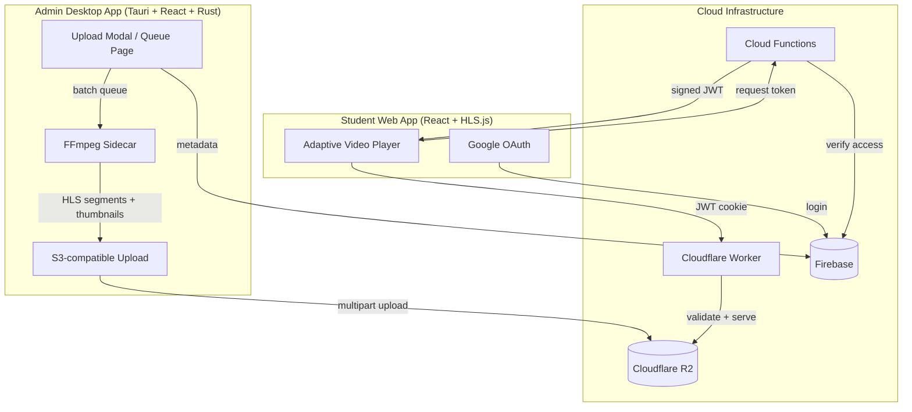

# SecureStream LMS

A private, cost-optimized video streaming platform for course creators. Local-First architecture keeps running costs under **$1/month** for up to 50 students.

## Architecture



## Components

### 1. Admin Desktop App — `admin-app/`
**Tauri (Rust backend) + React (frontend) + Tailwind CSS v4**

The content management hub. Admins use this desktop app to transcode, upload, and organize video content.

| Feature | Implementation |
|---|---|
| **Video Processing** | FFmpeg sidecar → HLS segments (360p–1080p) |
| **Configurable Segments** | HLS segment duration (2–60s) via Settings |
| **Thumbnail Generation** | Auto-extract frame at 25% or custom upload |
| **Upload Pipeline** | Concurrent multipart uploads to R2 via S3 SDK |
| **Queue System** | Batch processing with progress tracking, localStorage persistence |
| **Playlist Management** | CRUD playlists via Firestore |
| **User Management** | Grant/revoke playlist access per user |


**Key files:**
- `src-tauri/src/lib.rs` — Rust commands: `probe_media`, `process_video`, `generate_thumbnail`
- `src/context/VideoQueueContext.jsx` — Queue state machine, R2 upload, thumbnail pipeline
- `src/pages/` — Dashboard, Playlists, Queue, Users, Settings, Login

---

### 2. Student Web App — `web-app/`
**React + Vite + Tailwind CSS + HLS.js**

The student-facing streaming portal. Deployed on Firebase Hosting.

| Feature | Implementation |
|---|---|
| **Authentication** | Google OAuth via Firebase Auth |
| **Authorization** | Role-based (admin/student), playlist-level access control |
| **Video Player** | HLS.js with adaptive bitrate switching (auto/manual quality selector) |
| **Token Management** | `useVideoToken` hook with auto-refresh before expiry |
| **Thumbnails** | Video thumbnails in playlist view, graceful fallback |

**Key files:**
- `src/components/VideoPlayer.jsx` — HLS.js player with quality selector
- `src/hooks/useVideoToken.js` — JWT lifecycle management
- `src/context/AuthContext.jsx` — Firebase Auth + Firestore role lookup

---

### 3. Cloud Functions — `functions/`
**Node.js (Firebase Functions v2)**

Serverless API endpoints for security-critical operations.

| Endpoint | Purpose |
|---|---|
| `generateToken` | Mint scoped JWTs for video access (validates playlist permission) |
| `grantAccess` | Admin grants user access to a playlist |
| `revokeAccess` | Admin revokes user access |
| `createVideo` | Create video metadata in Firestore |
| `bootstrapAdmin` | One-time admin account setup |

**Trigger:**
- `onUserCreate` — Auto-create user profile document on Firebase Auth registration

---

### 4. Cloudflare Worker — `securestream-worker/`
**Cloudflare Workers + R2**

The security gateway between students and video content.

| Feature | Implementation |
|---|---|
| **JWT Validation** | Verify token on every `.m3u8` and `.ts` request |
| **Token Scope** | Tokens are scoped to a video folder — can't access other content |
| **Cookie Auth** | Sets `HttpOnly; Secure; SameSite=None` cookie after first request |
| **Public Thumbnails** | `thumbnails/*` served without auth, 1hr cache |
| **CORS** | Configurable allowed origins |

---

### 5. Security Model

```
Student login (Google OAuth)
    → Firebase Auth (ID token)
        → Cloud Function: generateToken (checks playlistAccess in Firestore)
            → Scoped JWT (videoPath, userId, 1hr expiry)
                → Cloudflare Worker (validates JWT, serves from R2)
                    → HLS.js player (cookie auth for segments)
```

**Firestore Rules** enforce:
- Users can only read their own profile
- Playlists readable only with matching `playlistAccess` document
- Videos readable only if user has access to parent playlist
- All writes restricted to admin role

---

### 6. Database Schema (Firestore)

| Collection | Key Fields | Access |
|---|---|---|
| `users` | email, role, displayName | Read: self or admin |
| `playlists` | title, description, videoCount, thumbnailUrl | Read: admin or granted users |
| `videos` | title, playlistId, r2Path, thumbnailUrl, qualities, durationSeconds | Read: admin or playlist-granted users |
| `playlistAccess` | userId, playlistId, grantedBy, grantedAt | Read: self or admin |

---

## Tech Stack

| Layer | Technology |
|---|---|
| Admin Frontend | React, Tailwind CSS v4, Vite |
| Admin Backend | Rust (Tauri), FFmpeg |
| Web Frontend | React, Tailwind CSS, Vite, HLS.js |
| Auth | Firebase Authentication (Google OAuth) |
| Database | Cloud Firestore |
| Serverless API | Firebase Cloud Functions (Node.js) |
| Storage | Cloudflare R2 (S3-compatible, zero egress) |
| CDN/Security | Cloudflare Workers |
| Hosting | Firebase Hosting |

## Cost Model

| Scale | Monthly Cost | Breakdown |
|---|---|---|
| **50 students** | ~$0.90 | R2 storage only |
| **500 students** | ~$30 | Storage + Worker requests |

---

## Local Development

```bash
# Web App
cd web-app && npm install && npm run dev

# Admin App (requires Rust toolchain + FFmpeg)
cd admin-app && npm install && npm run tauri dev

# Functions
cd functions && npm install
firebase emulators:start --only functions

# Worker
cd securestream-worker && npm install
npx wrangler dev
```

## Deployment

```bash
# Web App → Firebase Hosting
cd web-app && npm run build
firebase deploy --only hosting

# Functions → Firebase
firebase deploy --only functions

# Worker → Cloudflare
cd securestream-worker && npx wrangler deploy
```

## Project Status
**Current Phase:** Phase 4 (Admin App & Polish)
**Build Status:** ✅ Core Functionality Complete
**Last Updated:** February 12, 2026
