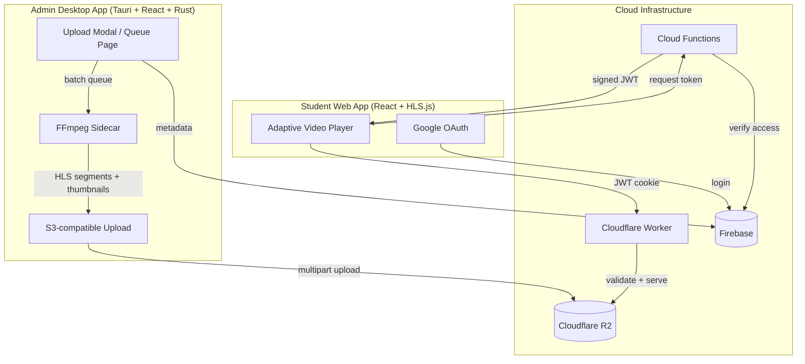

<div align="center">

# SecureStream LMS

**A private, cost-optimized video streaming platform for course creators.**  
Local-First architecture. Zero cloud transcoding costs. Under **$1/month** for 50 students.

[](./LICENSE)
[-orange?logo=rust)](https://tauri.app)
[](https://react.dev)
[](https://firebase.google.com)
[](https://developers.cloudflare.com)
[]()

Built by **[Mahmoud Khedr](https://github.com/Mahmoud-s-Khedr)**

</div>

---

## Why This Exists

Most video hosting platforms charge $50–$300+/month and offer little control over who sees your content. This project solves three hard problems for independent course creators:

| Problem | This Solution |
|---|---|
| 💸 **High running costs** | Cloudflare R2 zero-egress storage keeps costs under $1/month for 50 students |
| 🔓 **Link sharing & piracy** | Signed, scoped JWTs served as `HttpOnly` cookies — the URL is never exposed |
| 🐌 **Slow upload pipelines** | Concurrent multipart uploads via the Tauri desktop app — 5–10× faster than sequential |
| ☁️ **Expensive cloud transcoding** | FFmpeg runs **locally** as a Tauri sidecar — zero cloud processing cost |

---

## Key Engineering Highlights

> These are the interesting parts, for engineers reviewing the project.

- **Local-first transcoding pipeline** — The Tauri admin app embeds an FFmpeg sidecar. Videos are transcoded to HLS (360p–1080p adaptive bitrate) on the admin's machine before upload. No Lambda functions, no Mediaconvert costs.
- **Concurrent multipart uploads** — The upload pipeline splits HLS segments into parallel S3-compatible multipart uploads to Cloudflare R2, saturating the admin's upload bandwidth.
- **Scoped JWT tokens served as HttpOnly cookies** — Every `.m3u8` and `.ts` request goes through a Cloudflare Worker that validates a JWT scoped to a specific `videoPath`. The browser client never sees the token URL.
- **Cloudflare R2 for zero-egress storage** — R2 has no egress fees vs. S3's $0.09/GB. For a video-heavy app this is the largest cost lever.
- **Firestore security rules as the authorization layer** — Playlist access is enforced at the database level, not just the application layer. Users can only read playlists they have an `playlistAccess` document for.
- **Adaptive bitrate with HLS.js** — The student player auto-switches between quality tiers based on network conditions, with a manual override selector.

---

## Architecture


```mermaid
flowchart TB
    subgraph Admin["Admin Desktop App (Tauri + React + Rust)"]
        UI[Upload Modal / Queue Page]
        FFmpeg[FFmpeg Sidecar]
        R2Upload[S3-compatible Upload]
    end

    subgraph Cloud["Cloud Infrastructure"]
        R2[(Cloudflare R2)]
        Worker[Cloudflare Worker]
        Firebase[(Firebase)]
        Functions[Cloud Functions]
    end

    subgraph Student["Student Web App (React + HLS.js)"]
        Auth[Google OAuth]
        Player[Adaptive Video Player]
    end

    UI -->|batch queue| FFmpeg
    FFmpeg -->|HLS segments + thumbnails| R2Upload
    R2Upload -->|multipart upload| R2
    UI -->|metadata| Firebase

    Auth -->|login| Firebase
    Player -->|request token| Functions
    Functions -->|verify access| Firebase
    Functions -->|signed JWT| Player
    Player -->|JWT cookie| Worker
    Worker -->|validate + serve| R2
```

> For a deep dive into design decisions, see [DOCS/ARCHITECTURE.md](./DOCS/ARCHITECTURE.md).

---

## Components

### 1. Admin Desktop App — `admin-app/`
**Tauri (Rust backend) + React (frontend) + Tailwind CSS v4**

The content management hub. Admins use this desktop app to transcode, upload, and organize video content.

| Feature | Implementation |
|---|---|
| **Video Processing** | FFmpeg sidecar → HLS segments (360p–1080p) |
| **Configurable Segments** | HLS segment duration (2–60s) via Settings |
| **Thumbnail Generation** | Auto-extract frame at 25% or custom upload |
| **Upload Pipeline** | Concurrent multipart uploads to R2 via S3 SDK |
| **Queue System** | Batch processing with progress tracking, localStorage persistence |
| **Playlist Management** | CRUD playlists via Firestore |
| **User Management** | Grant/revoke playlist access per user |

**Key files:**
- `src-tauri/src/lib.rs` — Rust commands: `probe_media`, `process_video`, `generate_thumbnail`
- `src/context/VideoQueueContext.jsx` — Queue state machine, R2 upload, thumbnail pipeline
- `src/pages/` — Dashboard, Playlists, Queue, Users, Settings, Login

---

### 2. Student Web App — `web-app/`
**React + Vite + Tailwind CSS + HLS.js**

The student-facing streaming portal. Deployed on Firebase Hosting.

| Feature | Implementation |
|---|---|
| **Authentication** | Google OAuth via Firebase Auth |
| **Authorization** | Role-based (admin/student), playlist-level access control |
| **Video Player** | HLS.js with adaptive bitrate switching (auto/manual quality selector) |
| **Token Management** | `useVideoToken` hook with auto-refresh before expiry |
| **Thumbnails** | Video thumbnails in playlist view, graceful fallback |

**Key files:**
- `src/components/VideoPlayer.jsx` — HLS.js player with quality selector
- `src/hooks/useVideoToken.js` — JWT lifecycle management
- `src/context/AuthContext.jsx` — Firebase Auth + Firestore role lookup

---

### 3. Cloud Functions — `functions/`
**Node.js (Firebase Functions v2)**

Serverless API endpoints for security-critical operations.

| Endpoint | Purpose |
|---|---|
| `generateToken` | Mint scoped JWTs for video access (validates playlist permission) |
| `grantAccess` | Admin grants user access to a playlist |
| `revokeAccess` | Admin revokes user access |
| `createVideo` | Create video metadata in Firestore |
| `bootstrapAdmin` | One-time admin account setup |

**Trigger:**
- `onUserCreate` — Auto-create user profile document on Firebase Auth registration

---

### 4. Cloudflare Worker — `securestream-worker/`
**Cloudflare Workers + R2**

The security gateway between students and video content.

| Feature | Implementation |
|---|---|
| **JWT Validation** | Verify token on every `.m3u8` and `.ts` request |
| **Token Scope** | Tokens are scoped to a video folder — can't access other content |
| **Cookie Auth** | Sets `HttpOnly; Secure; SameSite=None` cookie after first request |
| **Public Thumbnails** | `thumbnails/*` served without auth, 1hr cache |
| **CORS** | Configurable allowed origins |

---

### 5. Security Model

```
Student login (Google OAuth)
    → Firebase Auth (ID token)
        → Cloud Function: generateToken (checks playlistAccess in Firestore)
            → Scoped JWT (videoPath, userId, 1hr expiry)
                → Cloudflare Worker (validates JWT, serves from R2)
                    → HLS.js player (cookie auth for segments)
```

**Firestore Rules** enforce:
- Users can only read their own profile
- Playlists readable only with matching `playlistAccess` document
- Videos readable only if user has access to parent playlist
- All writes restricted to admin role

---

### 6. Database Schema (Firestore)

| Collection | Key Fields | Access |
|---|---|---|
| `users` | email, role, displayName | Read: self or admin |
| `playlists` | title, description, videoCount, thumbnailUrl | Read: admin or granted users |
| `videos` | title, playlistId, r2Path, thumbnailUrl, qualities, durationSeconds | Read: admin or playlist-granted users |
| `playlistAccess` | userId, playlistId, grantedBy, grantedAt | Read: self or admin |

---

## Tech Stack

| Layer | Technology |
|---|---|
| Admin Frontend | React, Tailwind CSS v4, Vite |
| Admin Backend | Rust (Tauri), FFmpeg |
| Web Frontend | React, Tailwind CSS, Vite, HLS.js |
| Auth | Firebase Authentication (Google OAuth) |
| Database | Cloud Firestore |
| Serverless API | Firebase Cloud Functions (Node.js) |
| Storage | Cloudflare R2 (S3-compatible, zero egress) |
| CDN/Security | Cloudflare Workers |
| Hosting | Firebase Hosting |

---

## Cost Model

| Scale | Monthly Cost | Breakdown |
|---|---|---|
| **50 students** | ~$0.90 | R2 storage only |
| **500 students** | ~$30 | Storage + Worker requests |

---

## Quick Start

### Prerequisites
- Node.js 18+
- Rust toolchain (for admin app)
- FFmpeg installed locally
- Firebase CLI: `npm install -g firebase-tools`

### Run locally

```bash
# Student Web App
cd web-app && npm install && npm run dev

# Admin App (requires Rust toolchain + FFmpeg)
cd admin-app && npm install && npm run tauri dev

# Cloud Functions
cd functions && npm install
firebase emulators:start --only functions

# Cloudflare Worker
cd securestream-worker && npm install && npx wrangler dev
```

See [DEPLOYMENT.md](./DEPLOYMENT.md) for the full step-by-step deployment guide.

---

## Project Status

| | |
|---|---|
| **Build Status** | ✅ Core Functionality Complete |
| **Phase** | Phase 4 — Admin App & Polish |
| **Last Updated** | March 2026 |

---

## Documentation

| Doc | Description |
|---|---|
| [DEPLOYMENT.md](./DEPLOYMENT.md) | Step-by-step deployment guide for all 4 components |
| [DOCS/ARCHITECTURE.md](./DOCS/ARCHITECTURE.md) | Deep-dive into design decisions and system architecture |
| [DOCS/DESIGN_DECISIONS.md](./DOCS/DESIGN_DECISIONS.md) | Original design rationale and problem framing |

---

## Contributing

Contributions, issues, and feature requests are welcome! See [CONTRIBUTING.md](./CONTRIBUTING.md) for guidelines.

---

<div align="center">

Built with ❤️ by **[Mahmoud Khedr](https://github.com/Mahmoud-s-Khedr)** · [MIT License](./LICENSE)

</div>
